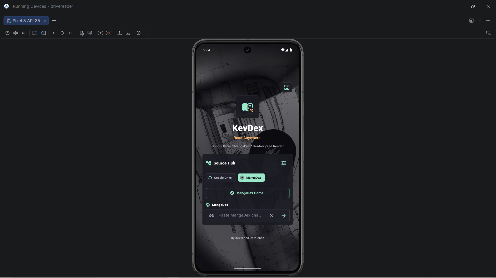
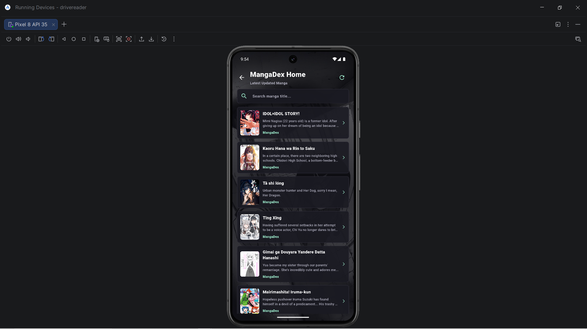
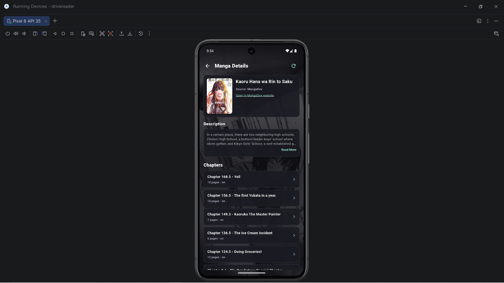
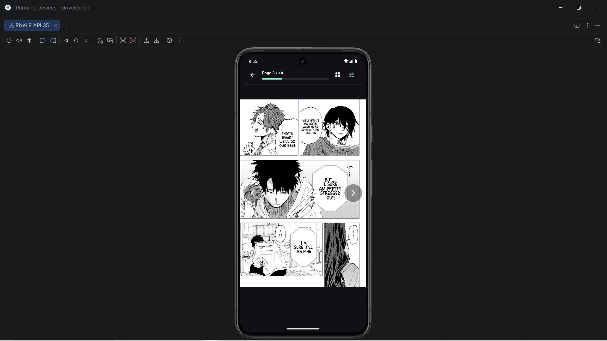

<div align="center">

# 📖 KevDex
### A personal manga & doujin reader for Android

[](https://github.com/tranafbaskevin/drivereader/releases/latest)
[](https://flutter.dev)
[](#disclaimer)

</div>

---

## ✨ Features

| Source | Description |
|--------|-------------|
| 📚 **MangaDex** | Browse and read manga with full chapter support |
| 🖼️ **Hitomi.la** | Gallery browser with infinite scroll & CDN routing |
| 🔞 **NHentai** | Mirror-aware reader (nhentai.net / nhentai.to) |
| 📁 **Google Drive** | Read your own manga files stored in Drive |

**App highlights:**
- 🏠 Home feed for each source with infinite scroll / load-more
- 🖼️ Thumbnail blur toggle for sensitive content
- 💾 Library page to manage saved stories
- 🌙 Dark-first UI design
- 🔁 Automatic CDN routing update (no stale image URLs)

---

## Screenshots

<div align="center">
  
  
  <br>
  
  
</div>

---
## 📲 Download

> **[⬇ Download latest APK → Releases](https://github.com/tranafbaskevin/drivereader/releases/latest)**

Install the `.apk` directly on your Android device.  
*(You may need to enable "Install from unknown sources" in Settings)*

---

## 🔧 Build from source

**Requirements:** Flutter 3.x · Android SDK · Java 17+

```bash
# Clone
git clone https://github.com/tranafbaskevin/drivereader.git
cd drivereader

# Install dependencies
flutter pub get

# Run on connected device / emulator
flutter run

# Build release APK
flutter build apk --release
```

The output APK will be at:
```
build/app/outputs/flutter-apk/app-release.apk
```

---

## 📋 Changelog

### v2.4.0 — 2026-06-24
- 🐛 **fix(hitomi):** Fix all images failing to load due to Hitomi's `gg.js` CDN routing script changing its format (switch-case logic inverted). Thumbnails on the home page and all reader images now load correctly again.
- 🔄 **chore:** Update fallback `versionPath` to latest live value

### v2.3.1
- ✨ Add thumbnail blur toggle for sensitive content on Hitomi home

### v2.3.0
- ✨ Add Hitomi home page with infinite scroll and parallel gallery loading

### v2.2.9
- 📝 Clarify NHentai mirror limits in UI

### v2.2.8
- 🐛 Fix Hitomi image routing (previous CDN host change)

### v2.2.5
- ✨ Stage private source inputs

### v2.2.3
- ✨ Add private source gate

### v2.2.2
- ✨ Add clear cache action

### v2.2.1
- ✨ Add full library page

### v2.2.0
- ✨ Add source hub foundation

---

## ⚠️ Disclaimer

> **This application is a personal project intended for personal use only.**
>
> - KevDex does **not** host, store, or distribute any copyrighted content.
> - It is a **reader/client** that connects to existing public or self-owned sources.
> - Users are solely responsible for ensuring their use complies with the laws of their country and the Terms of Service of any third-party website they access through this app.
> - The developer does **not** condone piracy or any illegal use of this software.
> - This app is **not affiliated** with MangaDex, Hitomi, NHentai, or Google.

---

<div align="center">
Made with ❤️ by <a href="https://github.com/tranafbaskevin">Kevin</a> · Powered by Flutter
</div>
